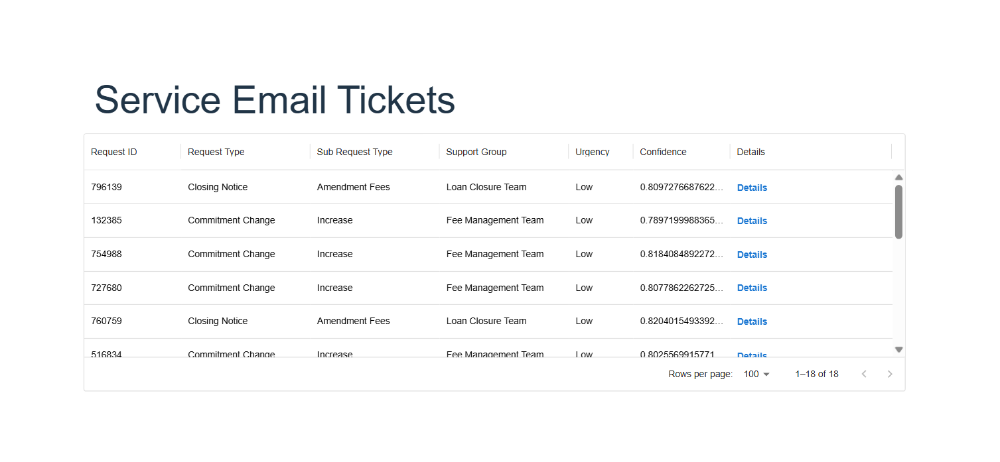
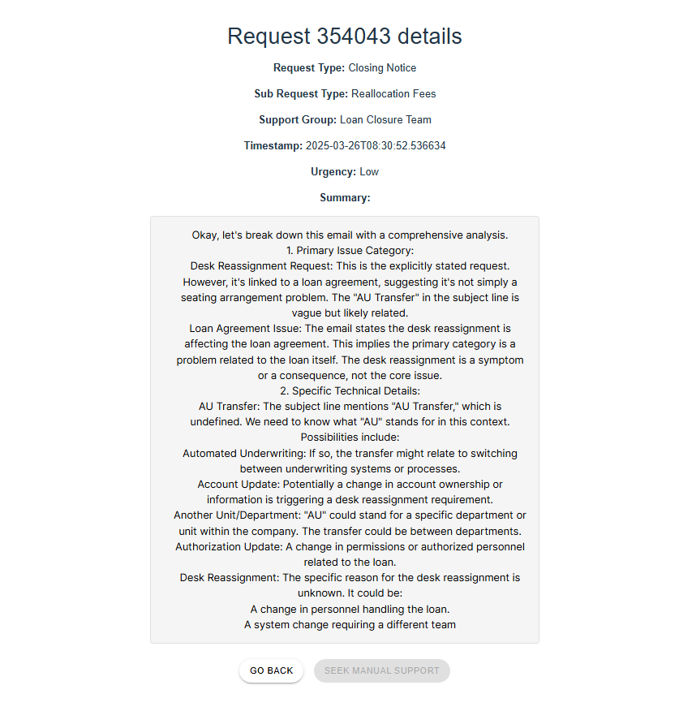
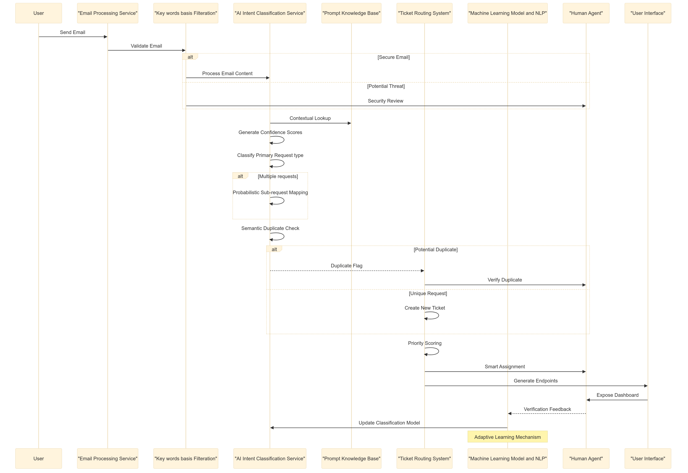

# 🚀 Gen AI Orchestrator for Email and Document Triage/Routing

## 📌 Table of Contents
- [Introduction](#-introduction)
- [Demo](#-demo)
- [Inspiration](#-inspiration)
- [What It Does](#️-what-it-does)
- [How We Built It](#️-how-we-built-it)
- [Challenges We Faced](#-challenges-we-faced)
- [How to Run](#-how-to-run)
- [Tech Stack](#️-tech-stack)
- [Team](#-team)

---

## 🎯 Introduction
Welcome to our GenAI-based Email Classification and ticketing for loan servicing platforms. This project was developed as part of the Technology Hackathon focused on applying generative AI to streamline loan servicing workflows. Our solution uses advanced LLMs to automatically classify incoming emails, extract relevant information, and generate structured data for seamless integration with existing loan servicing systems.


## 🎥 Demo
🔗 [Live Demo](#) (if applicable)  
📹 [Video Demo]
<video controls src="https://github.com/user-attachments/assets/64075730-f847-4f0c-8e72-ed68a4284c31" title="Demo video"></video>
🖼️ Screenshots:

**UI Screens:**



**Design Flow:**


## 💡 Inspiration
Loan servicing operations are often bogged down by manual email processing, leading to:
- Delayed response times to customer requests
- Inconsistent classification of service requests
- Human error in data extraction
- Inefficient allocation of human resources
Our team was inspired to solve these challenges by leveraging the latest advancements in generative AI to create an intelligent system that can understand, classify, and extract information from unstructured emails and documents with high accuracy and consistency.

## ⚙️ What It Does
**Our solution provides an end-to-end AI pipeline that:**
- Reads and processes emails - Ingests emails and attachments from various sources
- Classifies requests - Identifies the primary request type and sub-request type
- Extracts critical information - Pulls out relevant data points like amounts, dates, and account details
- Assigns confidence scores - Provides reliability metrics for classifications
- Detects duplicates - Identifies potential duplicate requests to prevent redundant processing
- Generates structured output - Creates standardized JSON for system integration which can be integration with UI
- Provides explanations - Offers reasoning for classifications to assist human reviewers
- The system handles a comprehensive range of loan servicing request types, including:
Adjustments
Administrative Unit Transfers
Closing Notices
Commitment Changes
Fee Payments
Money Movement (Inbound and Outbound)
And more...

## 🛠️ How We Built It
Our solution consists of three main components:
1. **Email Processing Service**
Connects to email servers and document repositories
Parses emails, extracts attachments
Preprocesses text for optimal AI analysis

2. **AI Classification Service**
Utilizes LLMs (OpenAI's GPT,Gemini Pro,NLTK ,spacy) with custom prompt engineering
Implements a classification pipeline with context-aware prompting
Features confidence scoring algorithms
Includes duplicate detection logic
Maintains explainability for all classifications

3. **Service Ticket Response System**
Generates structured JSON outputs
Provides RESTful API endpoints for integration
Includes a dashboard for human review of classifications
Implements feedback loops for continuous improvement
The system architecture follows modern microservices design principles, ensuring scalability and maintainability.

## 🚧 Challenges We Faced

Throughout development, we encountered several challenges:
Prompt Engineering Complexity - Fine-tuning prompts to handle the nuanced differences between request types required extensive iteration and testing.
Context Preservation - Ensuring the AI model maintained awareness of the full context when processing lengthy emails with multiple topics.
Confidence Calibration - Developing reliable confidence metrics that accurately reflected classification certainty.
System Integration - Designing clean interfaces between services while maintaining end-to-end performance.
Handling Edge Cases - Building resilience for unusual or ambiguous requests that don't clearly fall into predefined categories.

## 🏃 How to Run
1. Clone the repository:
```powershell
git clone https://github.com/ewfx/gaied-ai-gladiators.git
cd gaied-ai-gladiators
```

2. Create and activate a virtual environment:
```powershell
python -m venv wfhack
.\wfhack\Scripts\Activate.ps1
```

3. Install required packages:
```powershell
pip install -r requirements.txt
```

4. Download required NLP models:
```powershell
python -m spacy download en_core_web_md
python -c "import nltk; nltk.download('punkt'); nltk.download('averaged_perceptron_tagger'); nltk.download('wordnet')"
```

## Configuration

1. Create a `config.json` in the `code/src` directory:
```json
{
    "providers": {
        "google": {
            "api_key": "your-gemini-api-key"
        }
    }
}
```

2. Place your email files in the `emails` directory at the project root.

## Running the Application

1. Activate the virtual environment (if not already activated):
```powershell
.\wfhack\Scripts\Activate.ps1
```

2. Navigate to the source directory:
```powershell
cd code\src
```

3. Start the server:
```powershell
python -m uvicorn TicketResponseService:app --reload
```

The server will start at http://127.0.0.1:8000

## Available Endpoints

- `GET /tickets/` - Get all processed tickets
- `GET /tickets/{ticket_id}` - Get a specific ticket
- `GET /process-status` - Check email processing status
- `POST /process-emails` - Manually trigger email processing

## API Documentation

Once the server is running, you can access:
- Swagger API docs: http://127.0.0.1:8000/docs

## Frontend Setup

The frontend is built with React + TypeScript + Vite and uses Material-UI components.

### Prerequisites
- Node.js 18 or higher
- npm 9 or higher

### Installation

1. Navigate to the frontend directory:
```powershell
cd gaied-ai-gladiators/code/frontend
```

2. Install dependencies:
```powershell
npm install
```

### Running the Frontend

1. Start the development server:
```powershell
npm run dev
```
The frontend will be available at http://localhost:5173


## 🏗️ Tech Stack
- 🔹 Frontend: React 
- 🔹 Backend: FastAPI
- 🔹 Database: 
- 🔹 Other: Google gemini

## 👥 Team

Our diverse team brings together expertise in AI, software engineering, and financial services:

K V Subramanyeswar Sarma (Lead Software Engineer): A seasoned leader with deep technical expertise in software development, driving the architectural and strategic direction of our project.

Siddhant Antil (Software Engineer): A dynamic software engineer contributing fresh perspectives and coding expertise to accelerate development.

Santosh Kumar Potnuru (Lead Software Engineer): An experienced engineer providing robust design and implementation strategies to enhance system efficiency.

Sri Durga Sravanthi Bikkina (Senior Software Engineer):A mainframe modernization expert now exploring the AI/ML space, bringing a unique blend of legacy transformation knowledge and innovative AI-driven solutions.

Dharanidhar L Lokanandi (Senior Software Engineer):  A skilled Scrum Master facilitating agile execution while leading documentation efforts to ensure clear and structured project artifacts.

